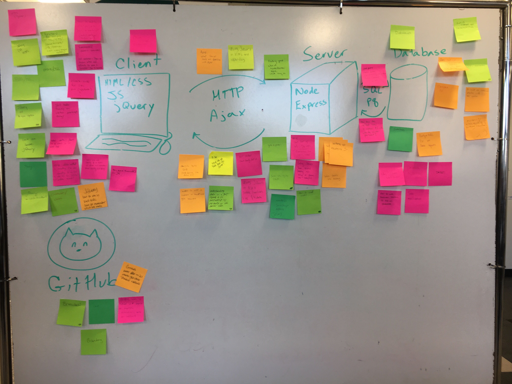

# Heatmap

Review / Question & Answer activity

## Example

## Objectives

- Allow students to ask targeted questions about this week's content
- Allow instructor to see trends in classroom understanding

## Materials
- Post-it notes, color coded (Red - Green / Warm - Cold)
- Code example, if desired

## Setup
Instructor needs to draw a map of concepts on the whiteboard.
Examples:
  - 3/4 stack
  - Full Stack
  - React Structure and Data
  - Redux Flow
  - Redux-Saga Flow
  

## Activity
Instruct students to write questions on hot colored post-its, and put it where they think it fits on the map. 

Also, have students write one thing they feel good about on a cool colored post-it, and put it where they think it fits on the map.

Everyone should have at least one question and one feel good.

This will take about 10-15 minutes.

After the post-its are up, one at a time, read each question aloud and answer it. 
Some questions are easy to just explain, some require some code/example.

This could be the next day, or immediately after. 

## Timing
This is best after all new content has been discussed. 

You could do this activity before the group project, or on the Friday before they get the Weekend Challenge.

It has also been used in place of later livesolves -- questions tend to be centered around the solution, so using a students code or a completed example would be helpful.
