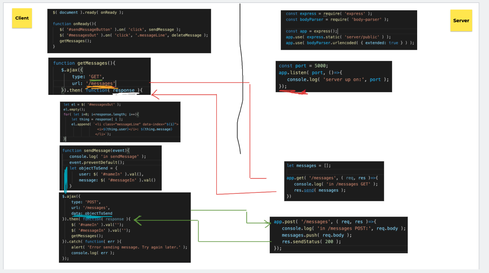
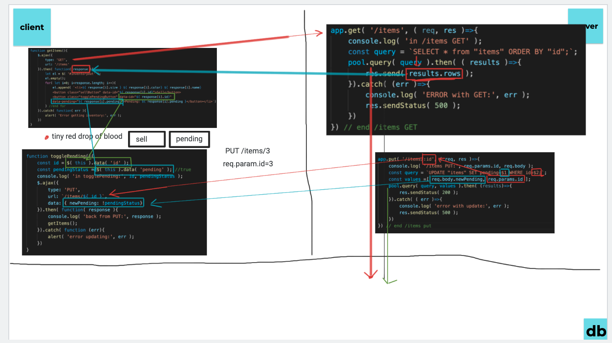
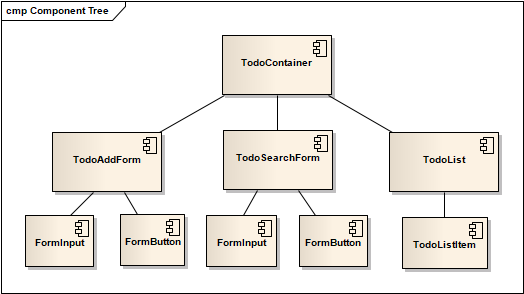
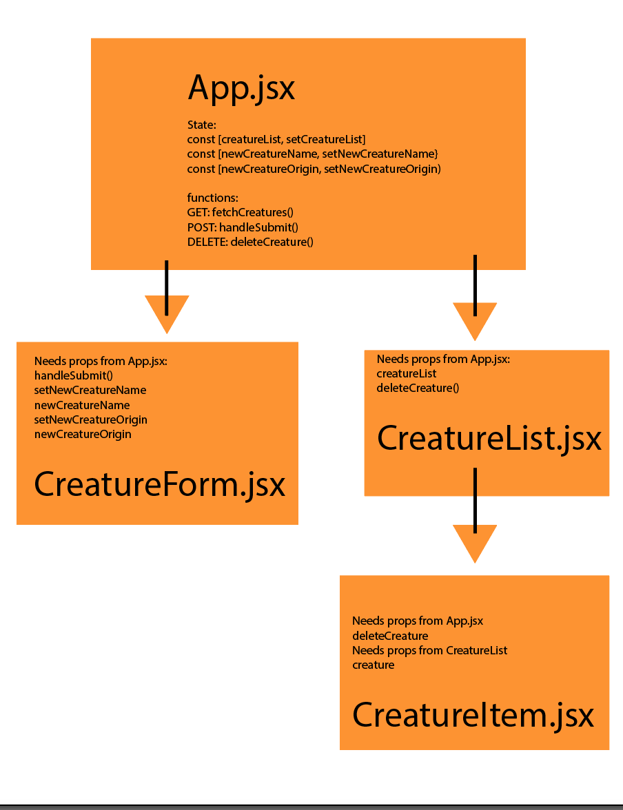
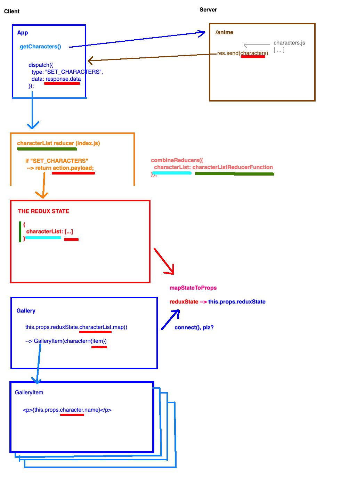
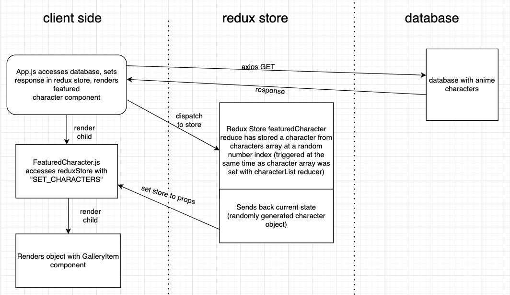
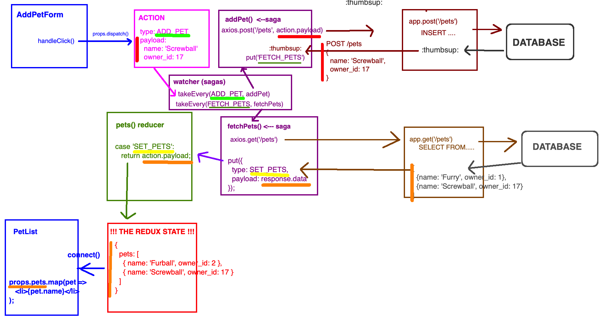
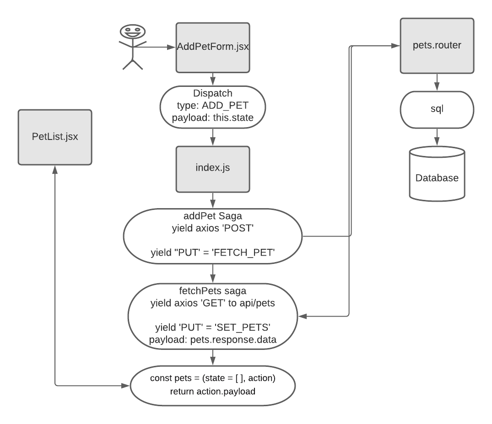

# Physical Fullstack

Physical Fullstack (PFS) is an in-class activity, focusing on the interaction between components and files in our stack. This activity is generally done on Fridays, as a review.

Objectives:

- Practice "Read" skills with an unfamiliar codebase
- Review concepts from the week
- Visualize code execution flow from file to file, across the stack
- Understand how data in one part of the stack translates to data in another part of the stack (eg. `data` passed to `$.ajax` becomes `req.body`)

---

## In-Person PFS

This activity will take about 20-30 mins per pod. Other pods should be working on the Weekend Challenge while 1 pod at a time goes through the exercise.

### Set-up

- Print out code from these repos, put them on a table in the classroom. 
- Organize them like our Conceptual Fullstack Drawing with clientside files on the left-hand side and serverside files and DB structure on the right-hand side
- Pull pods one at a time to do PFS

### Instructions

Each person in the pod will take a turn reading and talking through the code execution line by line. Usually this will be some logical section, like 1 function or 1 feature like the POST or the PUT from client to server and back.

- Provide some context as to what the app DOES
   - _Ex: "This is a fullstack inventory app that lets us add items and sell them."_
- Find somewhere to start, typically Application load, and role-play like: "OK, we've started up our server and pointed the browser to localhost:5000. What happens first?"
- Then start with 1 student
- Allow/encourage teammates to help struggling students through their sections
- Don't let students gloss over details, they should practice "speaking" code with proper terms like "assign", "value", "call", "request", etc.

**There are usually 1 or 2 main big points or takeaways each week so be sure to pause on those sections of code and ask for questions or clarifications.**

### Repos

These are ready to print, with code comments, wireframes/ui. See Readme in each repo.

- [Week 8: Serverside Messages](https://github.com/PrimeAcademy/physical-fullstack-week8-messages)
- [Week 9: Fullstack Inventory](https://github.com/PrimeAcademy/physical-fullstack-week9-inventory)
- [Week 10: React Fullstack Pantry](https://github.com/PrimeAcademy/physical-fullstack-week10-pantry)
- [Week 11: Redux Anime Gallery](https://github.com/PrimeAcademy/physical-fullstack-week11-anime)
- [Week 12: Saga Pet Manager](https://github.com/PrimeAcademy/physical-fullstack-week12-pets)

---

## Remote PFS

We have adapted PFS for a remote learning environment. The intent is to make the concepts and network connections feel "physical" and "concrete" in a virtual environment.

### Weeks 8/9

Split up your cohort into 2-3 groups, targeting 5-10 people per group, with one instructor to lead each group. Start by making a copy of the Jamboard template (see below), and sharing it with your group (with _Edit_ access).

Run through the exercises in the Jamboard, giving each person in the group a turn.

[**Week 8 Jamboard Template**](https://jamboard.google.com/d/1huCvWPT6jzJslgTv51COkRJJHZ0h4Za1qJecfVwW7RI/edit?usp=sharing)

_Exercises_
1. Visualize an HTML document. Have everyone grab a paper and pencil and draw out wireframes -- draw your own too, as an instructor. Have everyone hold up their drawing to the screen. Choose one person to talk through theirs.
2. Grab code snippets, and drag them to either the _client_ or _server_ sides of the board (1 person per snippet)
    - Try to approximate the "location" of the code within the app, where appropriate ("Does this go before or after the AJAX request?")
3. Walk through each snippet of code, and draw lines back and forth between client and server (1 person per snippet / line)
   - Pay special attention to how data moves. eg. underline variables in red, showing that `req.body` on the server is the same data as the `dataToSend` variable on the client

[**Week 9 Jamboard Template**](https://jamboard.google.com/d/1xp5Fo4p0xYTgLqnz49cwSxq-dzAlWY9D-Vwf4znFkT4/edit?usp=sharing)

_Exercises_
1. Visualize an HTML document. Have everyone grab a paper and pencil and draw out wireframes -- draw your own too, as an instructor. Have everyone hold up their drawing to the screen. Choose one person to talk through theirs.
2. Given a `CREATE TABLE` SQL command, fill in a visualization of what the data would look like in a table (1 or 2 ppl)
3. Walk through each snippet of code, and draw lines back and forth between client and server and DB (1 person per snippet / line)
   - Pay special attention to how data moves. eg. underline variables in red, showing that `results.rows` on the server is the same data as the `response` argument in the client

### Weeks 10/11/12

For these react/redux/sagas weeks, we do a diagraming exercise to build a visual sense of how data moves through the application.

The general mechanics are:
- Share a Github repo with all the sample code (see below)
- Students spend X minutes on their own creating a diagram (paper/pencil, lucidchart, paint, whatever), describing how data moves around the app. Focus on a single full-stack operation, eg. POSTing data from the _Create Pet_ form.
- Students show-and-tell their diagrams within their pods
- Students post their diagrams to their cohort slack channel
- Back to zoom classroom, instructor live-draws their own diagram
- Q&A

Example Week 10 instructions to students:

> Using this repo: <SEE LINKS BELOW>
Your goal is to make a map of this application. You can make it in the way that makes sense to you -- paper and pencil, a diagram tool online, etc.
This map needs to contain the front end components in use, and the data (state and props) each has. Try to map out how things get from one component to another.

Github repos:

- [Week 10: Pantry](https://github.com/PrimeAcademy/physical-fullstack-week10-pantry)
- [Week 11: Anime](https://github.com/PrimeAcademy/physical-fullstack-week11-anime)
- [Week 12: Pets](https://github.com/PrimeAcademy/physical-fullstack-week12-pets)

_Example Instructor Week 10 Diagram_

_Example Student Week 10 Diagram_

_Example Instructor Week 11 Diagram_

_Example Student Week 11 Diagram_

_Example Instructor Week 12 Diagram_

_Example Student Week 12 Diagram_

