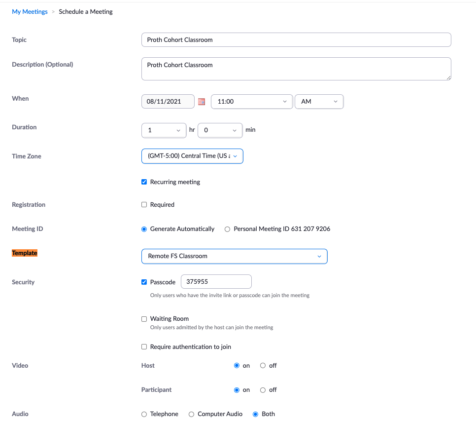
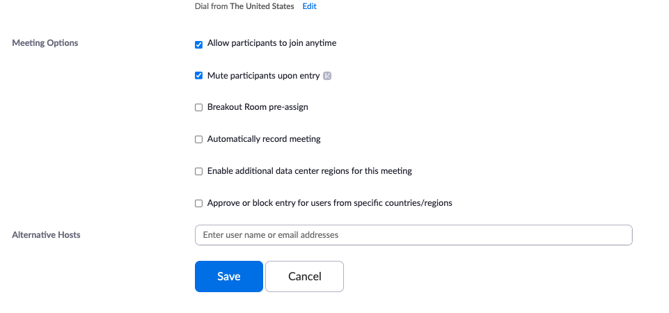

# New Cohort Set-up Tasks

## Week 0 - The Week Before Week 1

> NOTE Overlaps with previous cohort’s Tier 1/Week 6

## Student Life Tasks

Student Life takes care of a lot of the set-up during admissions and Orientation. You'll come in here at the end of that process and the beginning of Tier 1.

**They Will:**
- Update and send Orientation Email (after Orientation, see below)
- Update Welcome Emails (these are sent Week 1 Monday)
- Create Cohort Calendar, invite instructors
    - Check your email for an invite, you cannot search for it in the calendar app.
    - > If you haven't been invited, contact Emily for an invite.
- Create Slack Cohort Channel and invite students to join
- Create and share the Cohort's Google Spreadsheet
- Assign onboarding form to students, due Monday

---

## Instructor Tasks

### Communications

- Review landing pages sent out from Student Life (email)

### Create Slack Channels

- create cohort-instructors channel in Slack, Add other instructors and Student Life Lead

### Calendar Setup

- Cohort Calendar created by Student Life
- Copy calendar events from a previous cohort
  - Make a copy of this [Calendar Export/Import Spreadsheet](https://docs.google.com/spreadsheets/d/100vc25QoUxa1IqFCtDHoeDuBSsrgWBScOQt0EnanUWg/edit#gid=615914675) for your cohort
  - Follow the instructions in the spreadsheet,
  - You may want to remove Career Dev and Student Life events from the calendar, as these will already by added by those teams to your calendar.
  - Run the scripts to populate your cohort calendar with all the events from a previous cohort
- Send invitations as needed to calendar events. Do your colleagues a favor by getting these invites out early!
  - Invite guest instructors to Live Solves (Mondays, weeks 8, 9, and 10)
    - See the [cohort schedule](https://docs.google.com/spreadsheets/d/1x9rxflGvJYkIjCS5NFAbx60N0FYP8aOBCYRMwPSLyw0/edit#gid=239938709) to get a sense of which instructors may have availability
  - Invite UX Director to the _UX Principles_ Lecture (~W13D4)
  - Invite Dev to the _Project Management_ lecture (~W17D1)
  - Invite UX Director to the _UX Usability Consult_ for client projects (~W17D4)
  - Invite your senior cohort's instructor to _Solo Project Code Review_ (~W15D4)
  - Invite Kris to _Solo Presentation Practice_ (~W15D5)
  - Invite Mark, Bellamy, and Kris to _Client Presentation Practice_ (~W19D5 & W20D1)
  - Invite your junior cohort's instructor to _Solo Project Code Review_ (~W20D4)
- Book rooms in advance! Plan for:
  - Tier 1 daytime classes (so you have a quiet room to teach in)
  - One-on-ones
  - T3 Scope Reviews
  - T3 Code reviews
  - Presentation practice for solo and client projects (commons)
  - Client project kickoff meetings
  - Client project handoff meetings

## Github Setup

- Create GitHub Team for Cohort under Prime Academy
    - https://github.com/orgs/PrimeAcademy/teams
    - Add Team with Cohort name, proper noun style like: Affine, Atbash, Zaurak
    - Add each student to the cohort's Github team
      - get usernames from [Student Onboarding Form](https://docs.google.com/spreadsheets/d/1RLwwt1AJr1JZZUXz93uSx9fkAORpSot-r6hGM9Jwuxo/edit#gid=1592909825) responses. 
      - You may need to revisit this spreadsheet in Week 1, as more form responses come in. Make sure all your students are added to the team!

## Cohort Syllabus

- Create a repo called `PrimeAcademy/<cohort-name>-syllabus`
- Give _Read_ permission to your cohort's Github team
- Copy the [README](../../README.md) and [syllabus-schedule](../../cohort-syllabus/syllabus-schedule.md) and [curriculum-content](../../curriculum-content) from this repo into you syllabus repo
- Update all `@TODO` items from the syllabus

You will share this syllabus and talk through it's contents with students in the week 1 class. Students will be able to refer back to this syllabus throughout the program for lecture notes, links, etc. It's also a useful place to store other files/notes (eg. diagram images).

## Monitor Slack

- Slack will be accessible by students on the first Monday after Orientation!
- Drop in a message and say 'hi'!
- Monitor Slack (answer questions, help encourage others to answer questions, ask leading questions to coach on question asking/answering)

## Zoom Classroom Set-up

The main instructor should set up the Zoom Classroom, which is just a Zoom meeting set up as such:

- Allow people to join any time
- Recurring

These two settings make this room "always on", which allows students to hop in whenever they want, without an instructor.

### Zoom Recordings

Recorded Zoom meetings will can be found in your Recordings on zoom.us (the website). If you are the main Host who set up the classroom above, then every single recording in that room/meeting will be under YOUR account!

### Add Alt Hosts

Add all FS instructors as Alternate Hosts, which makes it easy to allow others to run the show.

Also add Career Development and Student Life.

## Other Setup Tasks

- Read through comments in the [Student Onboarding Form](https://docs.google.com/spreadsheets/d/1RLwwt1AJr1JZZUXz93uSx9fkAORpSot-r6hGM9Jwuxo/edit#gid=1592909825). Sometimes students tell us about planned absences, external issues, or other concerns that we should be aware of.
  - Planned absences should be added to the _Student Absences_ calendar. Make yourself a reminder closer to the date to plan for make-up if needed (eg. hand out WC early, share lecture recordings, etc.)
  - External issues should be noted in [Arc](https://trello.com/b/RyfOqTQT/arc).
- Create assignments in the portal. You can copy all assignments from a previous cohort from the [_Assignments_](https://portal.primeacademy.io/#/assignments) page, by clicking _Select many_. Or you may choose to copy assignments week-by-week.
- Plan for your [week 5 on-site class](../week-05-objects-html-css/05-01_class-guide-onsite.md). Send calendar invites to your director and student life support person. Plan to announce this event to your cohort in your Week 2 class, so they can plan ahead.