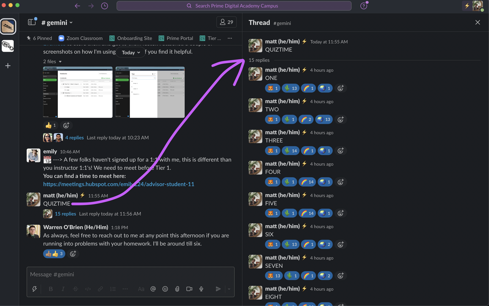
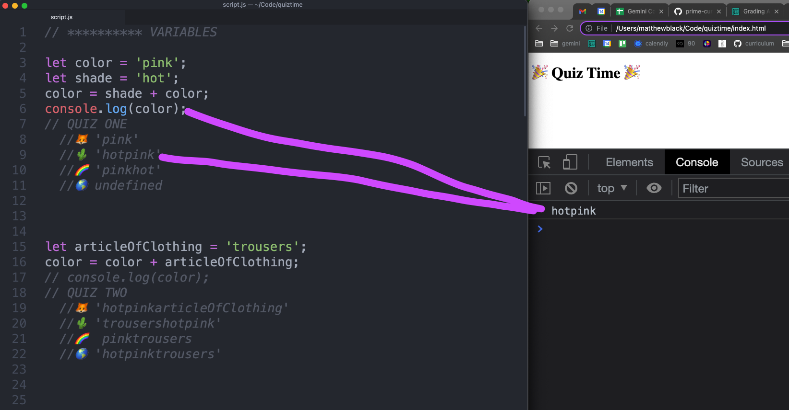

# Week 1-3 Review Quiz Game
---

This was a cool way to review all the Tier 1 content that students need to be solid on to really take advantage of functions in Week 4. It has four sections:
* Variables
* Conditionals
* Arrays
* Loops

There are 15 questions, and the idea is to only uncomment the code that pertains to an individual question. Once the majority of students have voted for what they expect the output to be in the Slack thread:

Refresh the browser and see the answer:

Pretty straightforward...

A handful of questions are intended to generate discussion and teach a little new stuff:
* FIVE: Short truthy/falsey lecture to explain: `(sockCount <=32 && mattIsWearingSocks)` 
* NINE: Nested arrays.
* THIRTEEN: Scope. `color` gets set to `'hotpinktrousers'` on Line 16. But the `for...of` loop allows its `color` variable to escape into global scope (no `let`). `'hotpinktrousers'` gets overwritten to `'blue'` when the loop finishes.
* FOURTEEN: Introduces the pattern of using a loop to modify data that lives in a higher scope.
* FIFTEEN: Strings are indexed like arrays. Kinda helpful for codewars type stuff.